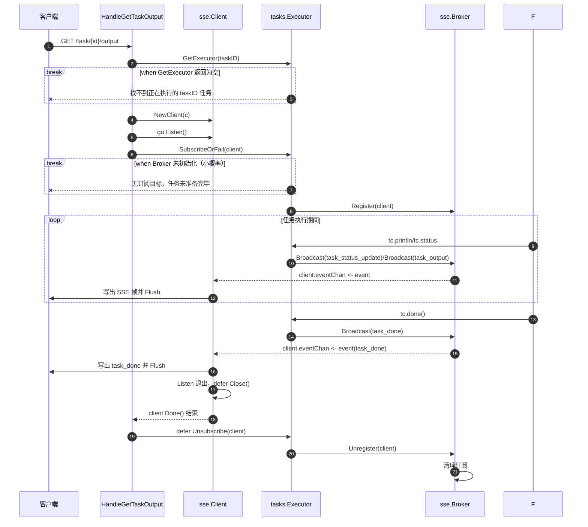

# SSE 生命周期

下面这张时序图整理了“客户端请求任务 SSE 输出”从建立连接到 `task_done` 后主动关闭的完整生命周期。

## 说明

- `HandleGetTaskOutput` 负责把 HTTP 请求升级为 SSE 连接，并把客户端注册到当前任务的执行器上。
- `tasks.Executor` 负责在任务执行期间广播状态和输出。
- `sse.Broker` 负责把事件分发给所有已订阅客户端。
- `sse.Client.Listen()` 负责把事件真正写到 HTTP 响应里；收到 `task_done` 后会退出，从而触发连接关闭。
- 路由层在连接结束后会执行退订，避免订阅残留。
